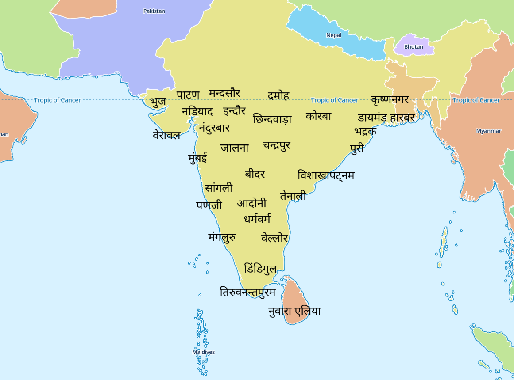

# Maplibre Canvas Labels

Proof-of-concept to render Hindi text labels with [TinySDF](https://github.com/mapbox/tiny-sdf)  in a HTML browser canvas and copying the resulting image to a MapLibre map.

## Demo

## Languages

  * [Hindi](https://bdon.github.io/maplibre-i18n/canvas#map=4.29/17.03/80.29&lanugage=hi)
  * [Tegulu](https://bdon.github.io/maplibre-i18n/canvas#map=4.29/17.03/80.29&language=te)
  * [Bengali](https://bdon.github.io/maplibre-i18n/canvas#map=4.29/17.03/80.29&language=bn)
  * [Gujarati](https://bdon.github.io/maplibre-i18n/canvas#map=4.29/17.03/80.29&language=gu)
  * [Malayalam](https://bdon.github.io/maplibre-i18n/canvas#map=4.29/17.03/80.29&language=ml)
  * [Punjabi](https://bdon.github.io/maplibre-i18n/canvas#map=4.29/17.03/80.29&language=pa)
  * [Marathi](https://bdon.github.io/maplibre-i18n/canvas#map=4.29/17.03/80.29&language=mr)
  * [Urdu](https://bdon.github.io/maplibre-i18n/canvas#map=4.29/17.03/80.29&language=ur)
  * [Persian](https://bdon.github.io/maplibre-i18n/canvas#map=4.29/17.03/80.29&language=fa)
  * [Arabic](https://bdon.github.io/maplibre-i18n/canvas#map=4.29/17.03/80.29&language=ar)
